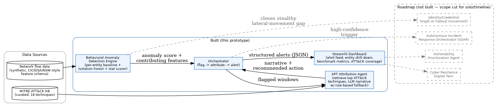

# AI-Driven Cyber Resilience — Behavioral Anomaly Detection + APT Attribution

**ET AI Hackathon 2026 — Problem Statement #7: AI-Driven Cyber Resilience for Critical National Infrastructure**

Solo build. Scoped deliberately to two of the five suggested sub-agents rather than attempting the full platform — see [Scope & what's not built](#scope--whats-not-built) for why, and the [Roadmap](#roadmap) for how the rest would extend this.

## What this is

The problem statement's core claim: most breaches at Indian public-sector and industrial organizations are discovered weeks to months after initial compromise, because detection relies on signature matching, and APTs deliberately operate "low-and-slow" to stay under signature thresholds. The fix has to be behavioral — flag deviation from how an entity *normally* behaves, not whether traffic matches a known-bad pattern.

This prototype builds that as two connected components:

1. **Behavioral Anomaly Detection Engine** — builds a per-entity (per-host) behavioral baseline from flow-aggregated network data, then scores each new time window by how far it deviates from that entity's own baseline, using an ensemble of Isolation Forest (catches multi-feature *combinations* that are jointly unusual), a statistical max-deviation scorer (catches single-feature spikes fast), and a peer-novelty signal (catches attackers reaching hosts an entity has never contacted before, even when traffic volume itself looks unremarkable).
2. **APT Campaign Attribution Agent** — for every flagged window, retrieves the MITRE ATT&CK techniques whose typical signal features overlap with what actually triggered the alert, then synthesizes an analyst-readable narrative and a concrete recommended action (via Claude if an API key is available, with an automatic rule-based fallback if not).

An orchestrator ties the two together into structured JSON alerts, and a Streamlit dashboard demos the whole pipeline: live alert feed, per-entity drill-down, benchmark metrics, and the curated ATT&CK knowledge base.

## Honesty notes — read before judging the numbers

This build ran inside a sandboxed environment with an outbound allowlist limited to PyPI, github.com, and the Anthropic API. **Kaggle, UCI, HuggingFace, GitHub raw content, and attack.mitre.org were all unreachable.** Two consequences, stated plainly rather than glossed over:

- **The dataset is synthetic, not the real UNSW-NB15/CICIDS2017 benchmark.** `src/generate_dataset.py` generates labeled, entity-level, flow-aggregated data with the same feature families those benchmarks use (duration, byte/packet counts, port/host fan-out, auth failures, protocol mix, time-of-day), and deliberately includes both "loud" (obvious) and "stealthy" (low-and-slow, dampened toward the entity's own baseline) variants of every attack type, plus benign-but-unusual normal traffic (legit large transfers, admin maintenance windows, vulnerability-scanner-like port sweeps) — specifically so the evaluation isn't artificially easy. **To use real data**: replace `build_dataset()` with a loader for the real CSVs (downloadable outside this sandbox); every downstream component just consumes a DataFrame with the documented column names, so nothing else needs to change.
- **The MITRE ATT&CK knowledge base (`src/attack_kb.py`) is hand-curated (18 techniques across 8 tactics), not a live TAXII/STIX pull.** Technique IDs and descriptions are accurate to the public framework, but this is a snapshot, not a live feed. Before real deployment, swap this for `mitreattack-python` against the official TAXII server.

Neither of these should be treated as swept under the rug — the presentation deck says so explicitly, and it's what a technically rigorous judge would ask about first.

## Results (on the synthetic evaluation set)

7,200 five-minute behavioral windows across 60 entities, ~410 attack windows (5.7% base rate), even split of loud/stealthy variants across 5 attack families (port scan, brute force, DoS, exfiltration, lateral movement).

| Metric | Value |
|---|---|
| ROC-AUC | 0.990 |
| PR-AUC | 0.896 |
| Precision @ operating threshold | 0.787 |
| Recall @ operating threshold | 0.829 |
| False positive rate | 1.35% |

**The blended recall number hides the real story, so here it is unblended** (full breakdown in `eval/metrics.json`, generated by `src/evaluate.py`):

- **Loud attacks: ~100% recall across all 5 families.** If it's an obvious spike, this catches it every time.
- **Stealthy port scan: 97.6% recall.** A `novel_peer_ratio` feature was added — tracking, per entity, which destination hosts it has actually contacted before, and flagging when it reaches ones it hasn't — which turned out to help port scan detection sharply, since scanning inherently touches previously-uncontacted hosts/ports.
- **Stealthy lateral movement: 31.0% recall**, up from 5.9% before the `novel_peer_ratio` feature (see below) — a real, ~5x improvement, but still the weakest category, honestly.
- **Stealthy exfiltration / DoS: 65-68% recall.**
- **Stealthy brute force: 37.8% recall — down from 67.6% before this change.** This is a genuine trade-off, not an oversight: the engine flags a fixed number of windows per run (contamination budget), and once peer-novelty made lateral-movement and port-scan windows rank higher, some borderline brute-force windows that used to just clear the cutoff no longer do, at the same total alert volume. Net effect across all attack types is still positive (every headline metric above improved), but it's a real illustration of a fixed-threshold detector: improving one axis can cost recall on another axis sharing the same alert budget. A production system would likely use per-attack-type thresholds rather than one global cutoff to avoid this; that's noted in the roadmap.

**Why `novel_peer_ratio` exists:** the original engine only saw aggregate traffic stats (byte/packet counts, ratios). An attacker moving laterally using stolen-but-valid credentials over already-common protocols (SMB/RDP) doesn't necessarily move enough *volume* to look anomalous in an already internal-traffic-heavy environment — measured directly during the first build, deviations were under 1 standard deviation from baseline. But reaching hosts an entity has *never contacted before* is a sparser, sharper signal that doesn't depend on volume at all. `generate_dataset.py` now simulates actual per-entity destination identities and tracks each entity's known-peer set causally (only using windows strictly before the current one, so there's no label leakage), and the anomaly engine picks up the resulting `novel_peer_ratio` feature like any other. This closes part of the gap — the honest remainder needs real identity/auth data (which account logged in where), which this prototype doesn't have.

An engine that reported ~100% recall across the board on a dataset the builder also generated would be a red flag, not an achievement — this one doesn't, and that's the point.

## Attribution accuracy

The hackathon's own evaluation focus for this problem statement names "APT attribution accuracy at MITRE ATT&CK technique level" — worth measuring honestly rather than just asserting the attribution agent "works" from a couple of example outputs. Two metrics, at two different levels of rigor, both in `src/attribution_eval.py` and `eval/attribution_accuracy.json`.

**Technique-level accuracy — 96.2% top-1, 98.8% top-3.** The obvious objection to any "attribution accuracy" claim is that no dataset has ground-truth ATT&CK technique-ID labels — that normally requires a red team tagging every packet with the exact technique used, which is true for third-party data like UNSW-NB15, where we didn't choose what technique each connection represents. It does **not** hold for the synthetic data, though: `generate_dataset.py`'s attack simulators were explicitly written to model specific named techniques (port_scan → T1595 Active Scanning, brute_force → T1110 Brute Force, dos → T1498 Network DoS, exfiltration → T1041 Exfiltration Over C2 Channel, lateral_movement → T1021 Remote Services). That design intent is a legitimate ground truth for data we generated ourselves, so exact technique-ID accuracy is measured directly against it — not asserted, not proxied. Where the simulator doesn't distinguish sibling sub-techniques (e.g. password-guessing vs. password-spraying under brute force), the expected label is the parent technique, and a retrieved sub-technique under that same parent counts as correct, since claiming more precision than the simulator actually has would be dishonest in the other direction.

**Tactic-level accuracy — 97.4% top-1, 99.4% top-3.** A looser, complementary check: does the top candidate's ATT&CK *tactic* match what's expected for the known attack type (e.g. a port scan should retrieve something tagged Reconnaissance/Discovery, not Credential Access). Reported alongside the technique-level number rather than instead of it.

Full per-attack-type breakdown for both metrics in `eval/attribution_accuracy.json`. Both checks are synthetic-data-only — the real UNSW-NB15 categories (Exploits, Fuzzers, Generic, ...) aren't ATT&CK labels at all and don't map onto the curated KB's coverage cleanly enough to make either check meaningful there, and forcing that mapping would produce a number that looks precise without being honest.

## Real-data validation (UNSW-NB15)

Everything above was tuned on synthetic data by necessity (see Honesty notes). To get an independent read on whether this actually generalizes, the real UNSW-NB15 dataset was obtained separately and run through the *same, unmodified* anomaly engine — proving the "swap in real data, nothing else changes" claim is literally true, not aspirational.

**What "real" means here, precisely**: the user's local UNSW-NB15 folder included the raw connection-record CSVs (`UNSW-NB15_1.csv`–`_4.csv`, 2.54M real connections, real source/destination IPs and ports, real timestamps). Three files that would have made this cleaner — the official column-name file, the pre-split training set, and the dataset's description PDF — were present only as broken OneDrive sync placeholders (zero-byte "_Error.txt" stand-ins), not usable. So the 49-column layout for the raw files in `src/load_unsw_real.py` is reconstructed from the dataset's well-documented public schema, cross-checked against the actual numbers (e.g. `sbytes/spkts` exactly equals the `smean` column under this column assignment, for multiple sample rows) rather than assumed blind. A handful of features (`internal_dst_ratio`, `admin_proto_ratio`, `failed_auth_count`) are necessarily approximations given what this dataset actually logs — see the header comment in `load_unsw_real.py` for exactly which fields are direct versus approximated.

`load_unsw_real.py` aggregates the raw connections into the same per-entity, 5-minute-window schema as the synthetic data (entity = source IP, causal peer-novelty tracking included), producing 6,257 real windows across 43 real hosts, 10.5% genuinely attack-labeled.

**Results are honestly weaker, as they should be**:

| Metric | Synthetic | Real UNSW-NB15 |
|---|---|---|
| ROC-AUC | 0.990 | 0.808 |
| PR-AUC | 0.896 | 0.251 |
| Precision @ operating point | 0.787 | 0.312 |
| Recall @ operating point | 0.829 | 0.312 |

Still clearly and meaningfully better than random (0.81 ROC-AUC, curve well above the diagonal — see `eval/roc_curve_real.png`), but nowhere near the synthetic numbers, and that gap is a genuine finding, not something to explain away. The real dataset's dominant attack categories are **Exploits** and **Fuzzers** (vulnerability exploitation and malformed-input fuzzing) — fundamentally different from the volumetric/behavioral attack archetypes (port scans, brute force, DoS, exfiltration, lateral movement) the synthetic data and this engine were designed around. A single exploit packet or a fuzzed payload doesn't necessarily produce a sustained shift in aggregate flow statistics the way a sustained brute-force or DoS does, so a per-entity aggregate-behavioral-baseline approach is structurally less suited to catching them. This is a real limitation of the *method*, not just the *dataset*, and it's exactly the kind of gap deep-packet/payload-inspection or signature-assisted layers exist to cover — worth stating directly rather than only ever showing the friendlier synthetic numbers.

Full breakdown (including per-category recall) in `eval/metrics_real.json`, generated by `src/evaluate_real.py`.

## Architecture



Solid boxes = built and working in this prototype. Dashed boxes = roadmap, not attempted here (see below for why).

## Repository layout

```
cyber-resilience-ai/
├── README.md                      this file
├── data/
│   ├── network_windows.csv        generated synthetic dataset (7,200 rows)
│   └── network_windows_real.csv   real UNSW-NB15, aggregated to the same schema (6,257 rows)
├── eval/
│   ├── metrics.json / metrics_real.json          synthetic / real benchmark numbers
│   ├── roc_curve.png / pr_curve.png               synthetic
│   ├── roc_curve_real.png / pr_curve_real.png     real UNSW-NB15
│   ├── alerts.json                 all 432 flagged alerts (synthetic run) with attribution
│   └── run_summary.json
├── assets/
│   └── architecture_diagram.png
└── src/
    ├── generate_dataset.py         synthetic data generator
    ├── load_unsw_real.py           real UNSW-NB15 loader (aggregates raw connections -> same schema)
    ├── anomaly_engine.py           Behavioral Anomaly Detection Engine
    ├── attack_kb.py                curated MITRE ATT&CK knowledge base
    ├── attribution_agent.py        APT Campaign Attribution Agent (retrieve + LLM/rule-based generate)
    ├── orchestrator.py             ties detection -> attribution -> structured alerts
    ├── evaluate.py                 benchmark metrics + ROC/PR curves (synthetic)
    ├── evaluate_real.py            same, for the real UNSW-NB15 data
    ├── dashboard.py                Streamlit demo UI
    └── make_architecture_diagram.py
```

## Running it

```bash
cd src
pip install -r ../requirements.txt   # scikit-learn, pandas, numpy, streamlit, matplotlib, anthropic, graphviz

python generate_dataset.py           # writes data/network_windows.csv
python evaluate.py                   # writes eval/metrics.json, roc_curve.png, pr_curve.png
python orchestrator.py               # writes eval/alerts.json, run_summary.json

# optional: enable LLM-generated attribution narratives (falls back to rule-based automatically without this)
export ANTHROPIC_API_KEY=your_key_here

streamlit run dashboard.py           # opens the demo UI
```

## How each component maps to the problem statement

| Problem statement sub-agent | Status | Where |
|---|---|---|
| Behavioural Anomaly Detection Engine | **Built** | `anomaly_engine.py` |
| APT Campaign Attribution & Prediction Agent | **Built** (scoped to attribution; "prediction of next-stage moves" is the immediate next roadmap extension) | `attribution_agent.py` |
| Autonomous Incident Response Orchestrator (SOAR) | Not built | roadmap |
| Government Infrastructure Vulnerability Prioritisation | Not built | roadmap |
| Cyber Resilience Digital Twin | Not built | roadmap |

## Scope & what's not built

Solo build, tight timeline, no GPU. Every sub-agent in the problem statement that needed data this sandbox couldn't reach, or infrastructure a solo hackathon entry can't credibly fake (live SOAR integration against real security tooling, a full digital twin of an organization's security architecture) was cut rather than half-built and demoed with false confidence. The two sub-agents built here were chosen specifically because they're evaluable with real, if synthetic, data and honest metrics — a smaller thing that's actually true beats a bigger thing that's actually vaporware.

## Roadmap

1. **Identity/credential-graph signals** to close the rest of the stealthy lateral-movement gap. The `novel_peer_ratio` feature (see Results) closed part of it using traffic data alone, but the honest ceiling for a flow-only signal is well below what identity/auth data (which account authenticated to which host, versus that account's own history) would achieve.
1b. **Per-attack-type or adaptive thresholds** instead of one global contamination cutoff, to avoid the brute-force-vs-lateral-movement trade-off documented in Results, where improving one attack type's ranking can push another below the shared alert budget.
2. **Next-stage move prediction** — the attribution agent currently explains what's already happened; extending it to rank likely next ATT&CK techniques given the current campaign stage was in the original problem statement's scope for this sub-agent.
3. **Autonomous Incident Response Orchestrator** — pre-approved containment playbooks (isolate endpoint, revoke credential, block IP) gated by confidence threshold, with human escalation above a blast-radius limit.
4. **Live ATT&CK feed** via TAXII instead of the curated snapshot.
5. ~~Real benchmark data swapped in~~ — **done**, see Real-data validation above. What it revealed: this engine is materially weaker on exploit/fuzzing-style attacks (real UNSW-NB15's dominant categories) than on the volumetric/behavioral attacks it was designed around. Closing that gap is now the actual next priority, likely via a payload/signature-assisted layer working alongside the behavioral one rather than a purely behavioral fix.
